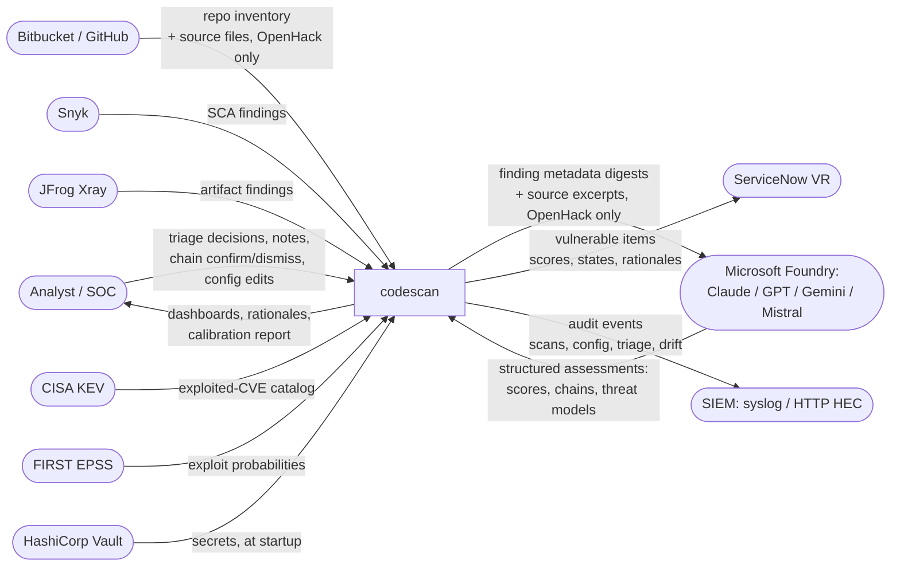
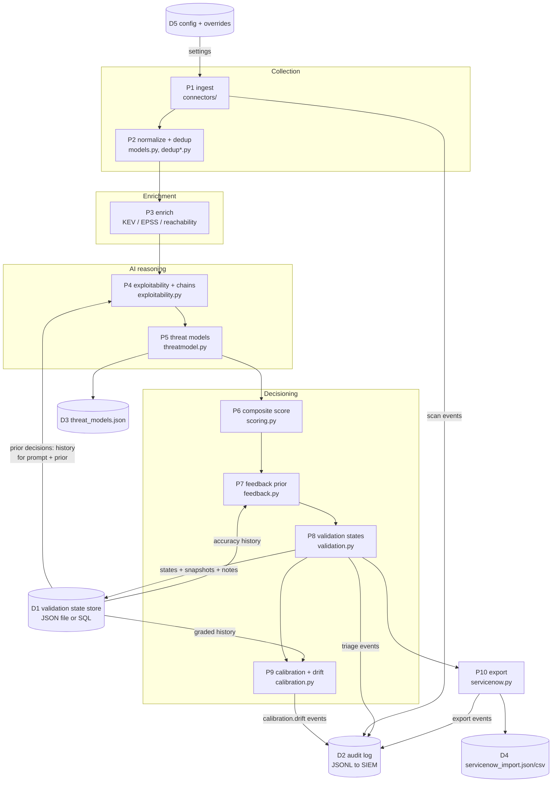
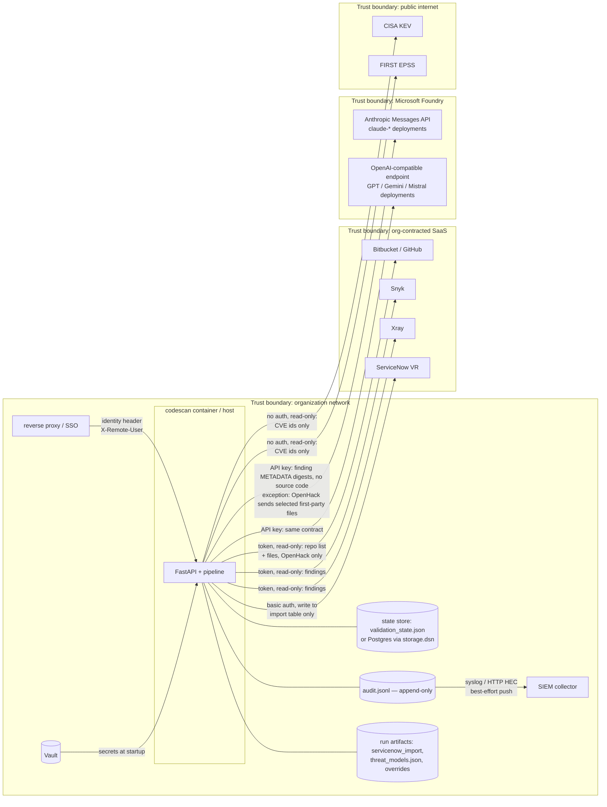

# codescan — Data Flow Diagrams (DFDs)

The formal DFD set for audit and governance use: **context** (level 0),
**logical** (level 1), and **physical** (deployment + trust boundaries).
Narrative documentation of the same flows lives in [DESIGN.md](DESIGN.md)
(§5 component design, §6 scan sequence, §8 security & privacy); the rendered
architecture diagram is [architecture.svg](architecture.svg). This document is
the *what data moves where* reference — including what crosses each trust
boundary and where data comes to rest.

## 1. Context DFD (level 0)

The system and its external entities. Every arrow is a data flow; credentials
for each flow are environment/Vault-sourced and never persisted by codescan.

## 2. Logical DFD (level 1)

Processes (P), data stores (D), and the flows between them for one scan.
Multilevel detail per process is in DESIGN.md §5.1–§5.10.

Key learning-loop flows (the closed loop): analyst decisions land in **D1**
with a machine-belief snapshot and optional note → **P4** receives them as
`prior_analyst_decisions` prompt context on similar findings → **P7** nudges
scores from the weighted history → **P9** grades predictions against outcomes
and raises drift to **D2**.

## 3. Physical DFD — deployment and trust boundaries

What crosses each boundary, over what, carrying what. All egress is HTTPS/TLS;
scanner and SCM tokens are read-only, ServiceNow write is scoped to the import
table (DESIGN.md §8, least privilege).

**Data at rest** (all inside the org boundary): the validation state store
(decisions, machine-belief snapshots, analyst notes), the append-only audit
log, threat models, the ServiceNow import file, and config overrides. codescan
persists nothing outside the org boundary; what Microsoft Foundry and
ServiceNow retain is governed by the org's contracts with them (data residency
follows the Azure region of the Foundry resource; DESIGN.md §8 documents the
disable/route-to-approved-deployment options).

**Crossing summary per boundary:**

| Boundary crossed | Data out | Data in | Control |
|---|---|---|---|
| → SaaS scanners/SCM | tokens (headers only) | findings, repo inventory, source (OpenHack) | read-only tokens, TLS |
| → Microsoft Foundry | finding metadata digests, triage-history counts/notes; source files **only** when OpenHack enabled | structured JSON assessments | `--no-ai` / per-stage toggles, Azure region of the resource, bounded file limits |
| → public enrichment | CVE identifiers only | KEV membership, EPSS scores | `--offline` skips entirely |
| → ServiceNow | scored vulnerable items incl. rationales | import results | write scoped to import table, idempotent `correlation_id` |
| → SIEM | audit events (actor, action, timestamps) | — | best-effort push; local file stays durable record |
