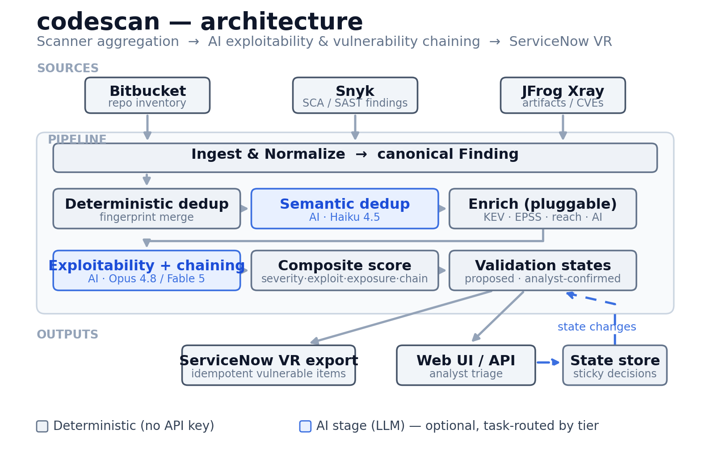
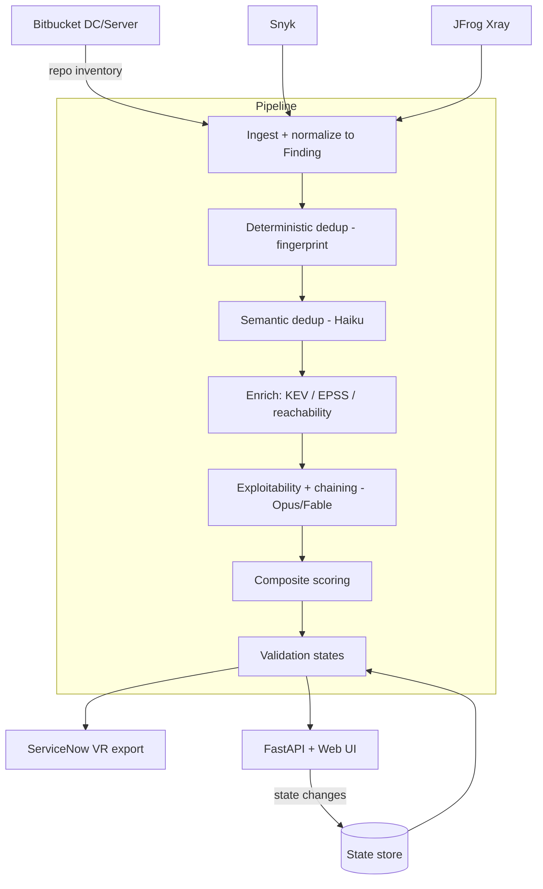
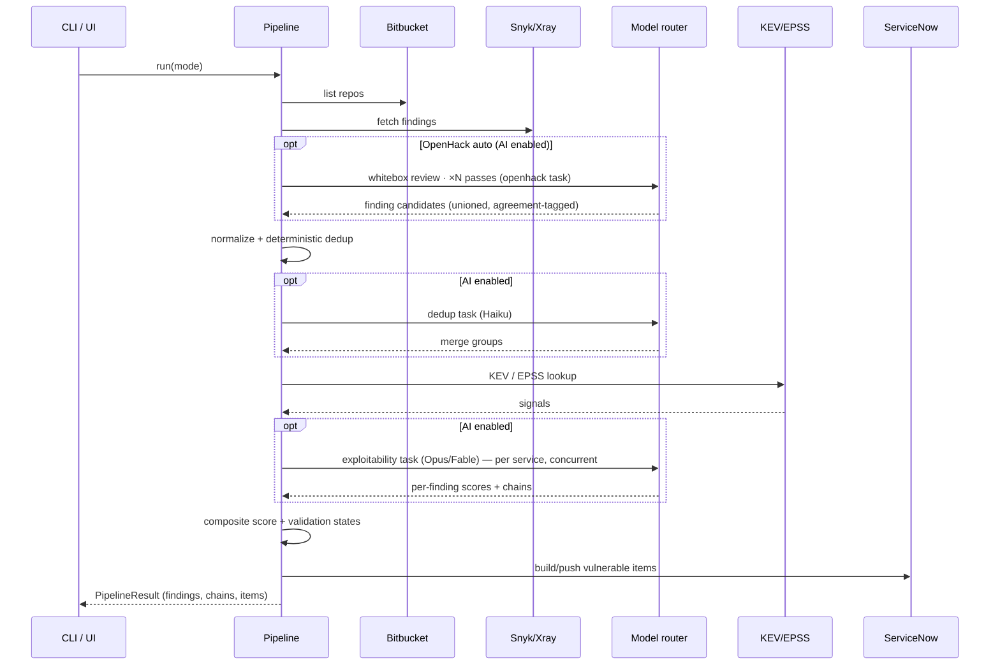

# codescan — Design Document

| | |
|---|---|
| **Status** | Draft / v0.1 |
| **Owner** | Application Security Engineering |
| **Scope** | Enterprise code-scanning aggregation, AI exploitability triage, and ServiceNow VR feed |
| **Related** | `README.md` (usage), source under `src/codescan/` |

---

## 1. Purpose

Two commercial scanners — **Snyk** and **JFrog Xray** — report vulnerabilities
against source in a **local Bitbucket Data Center** install. Neither output is
consumable on its own: they overlap, they rank by raw CVSS (which over-ranks
unreachable CVEs and under-ranks chainable mediums), and neither answers the
question a responder actually asks — *is this exploitable in our environment,
and how bad is it if several issues are combined?*

`codescan` is the pipeline that sits between the scanners and **ServiceNow
Vulnerability Response (VR)**. It aggregates and deduplicates findings, uses an
LLM to assess real-world exploitability and discover multi-step attack chains,
computes a composite risk score, tracks a validation lifecycle, and emits
ServiceNow-ready records — with an analyst UI on top.

### Goals

- One deduplicated finding per real weakness, regardless of how many scanners saw it.
- Exploitability judgement grounded in authoritative signals (KEV, EPSS, reachability), not raw CVSS.
- Explicit **attack chains** — sequences of findings that combine into a materially worse outcome — scored accordingly.
- A composite risk score that reorders the queue by *actual* risk.
- A validation-state lifecycle that survives rescans (analyst decisions are persisted).
- Output shaped for ServiceNow VR with idempotent upserts.
- Cost-appropriate model use: lower-cost models for mechanical work, deeper models for reasoning.

### Non-goals

- Running the scans themselves. Snyk/Xray own detection; codescan consumes their results.
- Being a system of record. ServiceNow VR is the SoR; codescan is a feeder and triage aid.
- Auto-remediation or auto-closing findings. It *proposes*; humans decide.
- Replacing CVSS/EPSS/KEV. It composes them.

---

## 2. Requirements → design mapping

| Requirement | Design element |
|---|---|
| Code in local Bitbucket | `connectors/bitbucket.py` — on-prem REST API builds the repo inventory (scan surface). GitHub/GHES (`connectors/github.py`) is a selectable alternative via `source.provider`. |
| Snyk + Xray available | `connectors/snyk.py`, `connectors/xray.py` — live pull or offline export, normalized to one `Finding`. |
| Output for ServiceNow Vulnerabilities | `servicenow.py` — `sn_vul_vulnerable_item` records, idempotent via `correlation_id`. |
| Validation states | `validation.py` + `models.py` — lifecycle + persistent state store + VR state mapping. |
| Deduplication | `dedup.py` (deterministic) + `dedup_ai.py` (semantic, lower-cost tier). |
| Exploitability incl. chaining, scored | `exploitability.py` (LLM) + `enrich/` (KEV/EPSS/reachability) + `scoring.py`. |
| AI tooling | `llm.py` — task→model router over the Anthropic SDK. |

---

## 3. Architecture



*Figure 1 — codescan pipeline architecture. Also available as [`architecture.svg`](architecture.svg)
and in [`DESIGN.docx`](DESIGN.docx). Regenerate with `python docs/make_diagram.py`.*



The pipeline is a linear series of pure-ish stages over a list of `Finding`
objects. Each stage reads and enriches the same in-memory list; nothing is
scanner-specific past ingestion. The two AI stages (semantic dedup,
exploitability) are optional — the deterministic pipeline produces scored,
ServiceNow-ready output on its own.

### 3.1 Layering

| Layer | Modules | Responsibility |
|---|---|---|
| Connectors | `connectors/`, `openhack_engine.py`, `openhack_runner.py` | Talk to external systems; emit/consume raw scanner shapes; in-process whitebox review. |
| Domain model | `models.py` | Canonical `Finding`, fingerprinting, state enums, difficulty signals. |
| Processing | `dedup*.py`, `enrich/`, `exploitability.py`, `scoring.py`, `validation.py`, `threatmodel.py` | Transform findings; synthesize threat models. |
| AI infrastructure | `llm.py`, `providers/`, `concurrency.py` | Model routing (+ auto-route), multi-provider client, bounded parallelism. |
| Orchestration | `pipeline.py` | Wire stages together; two ingest modes. |
| Interfaces | `cli.py`, `web.py`, `static/` | CLI, HTTP API, dashboard. |

Dependencies point downward only: interfaces depend on orchestration depends on
processing depends on the domain model. Connectors and `llm.py` are leaf
infrastructure.

---

## 4. Domain model

Everything downstream operates on one type, `Finding` (`models.py`). Snyk and
Xray describe the same weakness in different shapes; normalization at ingestion
means dedup, scoring, and export never branch on scanner.

Key sub-objects:

- `Component` — affected package (name, version, ecosystem, purl).
- `Location` — repo + path + branch.
- `Exploitability` — the assessment: level, 0–100 score, reachability, KEV flag, EPSS, rationale, chain IDs.
- `Severity`, `Source`, `ValidationState` — enums.

### 4.1 Fingerprint (the identity function)

Dedup and idempotent ServiceNow upserts both hinge on a stable identity:

```
fingerprint = sha256( vuln_key | component_key | repo )[:32]
  vuln_key       = sorted CVEs, else sorted CWEs, else lowercased title
  component_key  = name@version   (NOT the purl string)
  repo           = location.repo  (NOT the path)
```

Two deliberate choices, both learned from bugs the tests caught:

- **Component, not purl.** Snyk emits a purl; Xray often doesn't. Keying on the
  purl string would prevent the two scanners from ever merging. Normalized
  `name@version` aligns them.
- **Repo, not path.** Snyk reports the manifest path (`pom.xml`); Xray reports
  the artifact coordinate. For SCA findings the repository is the correct
  granularity. (Path-level identity would be right for SAST; see §11.)

---

## 5. Component design

### 5.1 Connectors

All three extend a shared `HttpClient` (bearer auth, retry/backoff on 429/5xx,
paging). Each connector has **two ingestion paths**:

- `fetch()` — live API pull.
- `from_file()` — load a native scanner export (Snyk `--json`, Xray violations).

The offline path is not just for demos: it makes the whole pipeline runnable in
CI, in tests, and against archived scan data with zero credentials.

**Findings sources are also pluggable.** Beyond Snyk/Xray (SCA/CVE), a third
source — **OpenHack** (`connectors/openhack.py`) — ingests whitebox
source-review findings (`finding-candidates/*.json`). These are first-party source
issues with no CVE (dedup keys on title + path); they carry severity, target path,
description, remediation, and OWASP/CWE-class tags, and flow through the same
normalize → dedup → score → triage path. This gives codescan findings for repos
the SCA/CVE scanners never covered. There are three ways to produce them:

1. **Built-in engine (default auto).** `openhack_engine.py` is an in-process
   whitebox review that runs against a cloned repo using codescan's own
   multi-provider LLM harness (§5.5) — no external tool. It walks the source,
   skips dependency/build/VCS dirs, reviews the security-relevant files first
   (auth, handlers, queries, uploads, crypto), batches source within a character
   budget, and asks the model (routed via the `openhack` task) for concrete,
   code-grounded vulnerabilities, writing OpenHack-schema finding candidates the
   connector ingests. This is what makes "auto" mode work inside codescan with the
   AI stages enabled.
2. **External command.** Set `openhack.command` to shell out to a separate
   OpenHack install; `{repo_path}`/`{output_dir}` are substituted and AI-provider
   env is passed through. `openhack_runner.py` clones the repo, dispatches to the
   built-in engine or the external command, and hands the output dir to the
   connector.
3. **Ingest an existing run** directory produced by any OpenHack run.

**Multiple review passes (recall).** AI source review is non-deterministic, so the
built-in engine runs `openhack.passes` independent passes (default **2**) and
**unions** the results — a vulnerability found in any pass is reported, so more
passes miss fewer. Duplicates across passes are consolidated on
(file, vulnerability class, title), keeping the strongest severity/confidence seen
and recording cross-pass agreement: a finding seen in every pass is tagged
`corroborated`, one seen once `single-pass`, with an "identified in N of M passes"
note — a confidence signal that survives to the `Finding`. Fixtures under
`fixtures/` drive the default UI and the test suite.

**Repo source is pluggable.** The repo inventory comes from either Bitbucket
Data Center (`bitbucket.py`) or GitHub / GitHub Enterprise Server (`github.py`),
selected by `source.provider` (editable in the config UI). Both emit the same
`Repo` list, and GitHub's identity is `owner/name` (its `full_name`), so Snyk/Xray
findings anchor to the same repo regardless of provider.

**Repo mapping.** Snyk projects and Xray builds must map back to repos
so their findings land on the same repo and can be deduped. The pipeline passes
a `name → repo` map into each connector; the current implementation matches by
slug and is the documented integration point to harden for production (§11).

### 5.2 Deduplication (two passes)

1. **Deterministic** (`dedup.py`) — group by fingerprint, merge collisions. The
   merge keeps the higher-severity record as primary, unions CVEs/CWEs/
   references/fixes, prefers a present CVSS and the longer description, records
   provenance from every contributing scanner, and keeps the earliest
   `first_seen`. A finding seen by both scanners earns a small **corroboration**
   bonus later in scoring.

2. **Semantic** (`dedup_ai.py`, optional, lower-cost tier) — catches cross-scanner
   duplicates the fingerprint misses: same weakness, divergent identifiers (one
   has a CVE, the other only a CWE + summary). It is deliberately narrow — it
   only compares findings in the *same repo + same component* and only merges
   what the model marks as clearly the same vulnerability. Different CVEs on the
   same package stay separate unless the descriptions say otherwise.

### 5.3 Enrichment (pluggable framework)

Enrichment is a **framework**, not a fixed step. Each source is a `BaseEnricher`
(`enrich/`) with an `enrich(findings)` method; `build_enrichers` assembles the
enabled ones from config and runs them in order. Adding a source (VEX, internal
asset criticality, exploit-DB) is a new subclass — no pipeline change. Built-in
enrichers:

- **CISA KEV** (`kev.py`) — is the CVE actively exploited in the wild?
- **FIRST EPSS** (`epss.py`) — probability of exploitation (batched lookups).
- **Reachability** (`reachability.py`) — heuristic over scanner metadata; returns
  `True`/`False`/`unknown` (negative phrasing checked first so "not reachable"
  isn't misread as "reachable").
- **AI enrichment** (`ai.py`, optional, lower-cost tier) — remediation guidance +
  categorization tags, and a reachability judgement when the scanner gave none.
  It complements the exploitability engine (which scores and chains) rather than
  duplicating it, and is routed to the `enrichment` task (Haiku by default).

Deterministic enrichers run first — cost-effective, authoritative, and
grounding for the LLM stages. Each is toggleable in config and **from the
config UI** (§5.9).
Network failures degrade gracefully rather than failing the run.

### 5.4 Exploitability & chaining engine

`exploitability.py` is the core value-add. It sends the LLM, per service, the
finding set plus the deterministic signals and asks two things:

1. **Per-finding exploitability in our context** (0–100) — weighting actively
   exploited / high-EPSS / network-reachable issues up, and unreachable /
   fix-available issues down.
2. **Attack chains** — ordered sequences of findings that combine into greater
   impact (e.g. SSRF → reach an internal service → unauthenticated RCE), each
   with a narrative, preconditions, impact, likelihood, chain score, and MITRE
   ATT&CK technique mapping.

Design points:

- **Grounded, not recalled.** The model receives KEV/EPSS/CVSS/reachability as
  facts, so its judgement is about *our exposure*, not CVE lookup.
- **Structured output.** A JSON Schema (`output_config.format`) guarantees a
  parseable response — no prompt-scraping.
- **Per-service scoping.** Chaining is scoped to a repo/service. Cross-service
  chains are only meaningful between components that actually talk to each
  other, and per-service scoping keeps each request tractable at enterprise
  scale.
- **Chains are cross-finding objects** and are returned separately (attached to
  findings by ID), not stored on any single finding.

### 5.5 Model routing + multi-provider harness (`llm.py`, `providers/`)

Every AI stage runs through a **provider harness** (`providers/`): each supplier
— `anthropic` (native structured outputs, adaptive thinking, effort, Fable
fallbacks), `openai` (and any OpenAI-compatible endpoint via `OPENAI_BASE_URL`),
`google` (Gemini) — implements the same `complete_json(request) -> dict`
contract. Non-Anthropic SDKs are imported lazily, so they're optional deps.
`ModelRouter` resolves a task to a `ModelSpec(provider, model, effort,
max_tokens)`, and `LLMClient` dispatches to the resolved supplier via the
registry — so a task can run on any model from any supplier, set in config.
Different tasks need different intelligence tiers:

| Task | Default tier | Rationale |
|---|---|---|
| `dedup` / `enrichment` | **Haiku 4.5** (effort n/a, 8k tokens) | Mechanical judgement. |
| `exploitability` | **Opus 4.8** (high effort, 32k) → Fable 5 for hardest chaining | Deep, judgement-heavy reasoning. |
| `threat_model` / `openhack` | default tier (`ai.model`) | Deep reasoning; route to Sonnet for cost. |
| *(anything else)* | default tier (`ai.model`) | Fallback. |

`LLMClient` adapts each request to the model's capabilities so callers never
have to: it omits `effort`/adaptive-thinking for models that don't support them
(Haiku), and enables server-side **refusal fallbacks** for Fable/Mythos (security
tooling can trip false-positive classifier refusals; the request transparently
re-serves on Opus 4.8 in the same call). Config `ai.tasks.<name>` overrides any
field per task. Adding a new AI stage is a one-liner: name a task, optionally
give it a built-in tier.

**Silent adaptive routing (`ai.auto_route`).** Off by default. When enabled, each
AI call is nudged up or down an Anthropic capability ladder —
**Haiku → Sonnet → Opus → Fable** — *relative to* its configured tier, by a
difficulty signal the calling stage computes (`group_difficulty` /
`size_difficulty` in `models.py`): a single low-severity finding downgrades
(cheaper), while an actively-exploited (KEV), multi-critical, or large group
upgrades (stronger reasoning). It only shifts Anthropic models that sit on the
ladder — a custom model id or another supplier is left exactly as configured — and
clamps at both ends. Enabling it is the operator's explicit opt-in; thereafter it
applies silently per call (`auto_route` in `llm.py`).

**Bounded concurrency (`ai.max_concurrency`, default 4).** The judgement-heavy
stages issue one request per repo/service; those requests are independent, so the
pipeline runs up to `max_concurrency` of them at once (`concurrency.py`,
order-preserving `map_workers`) — compute in parallel, apply sequentially, so
output stays deterministic. It's a latency optimization only (same requests, same
cost) and is bounded to stay within provider rate limits. Applies to
exploitability, threat modeling, AI enrichment, and semantic dedup.

**No prompt caching (deliberate).** The static system prompts sit far below the
model's minimum cacheable-prefix size and each request's payload differs, so a
cache breakpoint would never hit — it is omitted rather than added as dead weight.

### 5.6 Composite scoring (`scoring.py`)

A 0–100 blend of four weighted dimensions (weights configurable, normalized to
sum to 1):

| Dimension | Weight | Signal |
|---|---:|---|
| severity | 0.30 | CVSS-derived base impact |
| exploitability | 0.35 | AI score, EPSS, KEV, **threat signal** (averaged) |
| exposure | 0.20 | network reachability of the path |
| chaining | 0.15 | max chain score of chains the finding is in |

Adjustments on top of the blend:
- **KEV floor** — anything in the KEV catalog is floored to `kev_floor` (85).
  Actively exploited outweighs modelling.
- **Corroboration bonus** — +2 when both scanners agree.

**Threat models influence the score in exactly one place: the exploitability
dimension.** When threat modeling is on, a cited finding's `threat_signal` is one
of the averaged exploitability inputs above, so a threatened finding scores
higher — counted once, not double-weighted. Runs without threat modeling are
unaffected (`threat_signal` is 0).

This is the reordering that makes the queue useful: an unreachable critical CVE
drops below a reachable, chainable high.

### 5.7 Validation states (`validation.py`)

Internal lifecycle, mapped to ServiceNow VR states on export:

```
new → under_investigation → confirmed
                          ↘ false_positive
                          ↘ risk_accepted
                          ↘ duplicate
                          ↘ resolved
```

The pipeline **proposes** a conservative initial state (KEV or chained →
confirmed; unreachable + low exploitability → under_investigation as a candidate
FP; high score/severity → confirmed; else new). A human confirms or overrides.

**Persistence** is the important property. The `StateStore` persists each
decision keyed by fingerprint and tags whether a human set it (`manual`). On
rescan, `assign_states` honors any manual decision or terminal closure and
never re-opens it — analyst effort is never silently discarded. Machine
proposals remain re-derivable.

### 5.8 ServiceNow export (`servicenow.py`)

Builds `sn_vul_vulnerable_item` records, highest-risk first (VR queue order),
carrying the composite score, risk rating, validation state, and — critically —
the exploitability rationale and attack-chain context in the work notes, so a
responder sees *why* the tool ranked it. `correlation_id` is the fingerprint,
making the import idempotent: re-runs upsert the same item instead of creating
duplicates, and closed items stay closed. Output is written to a file — **JSON**
(`servicenow_import.json`) or, when `servicenow.format: csv`, a **CSV**
(`servicenow_import.csv`) for CSV Import Sets (multi-line work notes are quoted
correctly) — or POSTed to the configured import table via the Table API. The
format is settable in config, the config UI, or with `--sn-format` on the CLI.

### 5.9 Web UI (`web.py` + `static/index.html`)

FastAPI backend holding the latest `PipelineResult` in memory; a single
dependency-free HTML page for the frontend. Endpoints: `GET /api/state`,
`POST /api/scan`, `POST /api/findings/{id}/state`, `GET /api/servicenow`, and
`GET`/`POST /api/config`, and `GET /api/export` (JSON/CSV download). Four views:

- **Overview** — the landing page: run status (source, mode, last run), key
  metrics, a severity breakdown, quick actions (run, download JSON/CSV, jump to
  a tab), and an in-app usage guide. Makes the UI a complete usage surface — no
  CLI required.
- **Findings** — the triage queue with filters, signal badges, a per-finding
  detail drawer (CVSS vector, EPSS, reachability, provenance, rationale,
  remediation, tags, threats, chains), and inline validation-state editing that
  persists to the persistent store.
- **Threats** — the per-service threat models (§5.10): STRIDE threats with
  linked findings/chains, assets, entry points, trust boundaries, posture, and
  recommendations.
- **Config** — edit non-secret settings live: the repo source (Bitbucket/GitHub)
  and GitHub repo/org targets, default AI tier, per-task model routing,
  enrichment toggles, scoring weights, and the ServiceNow push flag/format.
  Secrets are shown masked and read-only (they stay in the environment). Edits
  apply to the next scan and persist to `config.overrides.json`, layered over
  the base config on restart. `POST` is validated server-side and rejected with
  400 on bad input.

Scans run from the header (AI / offline / live toggles + Run scan) via
`POST /api/scan`, in-process, recording a last-run timestamp. On-demand **live**
scans of Bitbucket/Snyk/Xray are supported (not just the boot mode). A failed
run — e.g. live mode without credentials — is caught and shown in an error
banner with the last good result preserved, rather than returning a 500;
`/healthz` backs the container probe.

---

### 5.10 Threat modeling (`threatmodel.py`, optional, deep tier)

Where the exploitability engine works bottom-up (per-finding scores, concrete
chains), threat modeling is the top-down counterpart. Per service it produces a
**STRIDE threat model** grounded in that service's findings and chains:

- **Assets** — what an attacker targets (data, credentials, functionality) with
  a sensitivity note.
- **Entry points / trust boundaries** — the attack surface implied by the
  components and findings.
- **Threats** — STRIDE-categorized, each citing the `related_finding_ids` and
  `related_chain_ids` that evidence it, plus likelihood, impact, and mitigations.
  The model is told to prefer fewer, well-grounded threats over generic ones.
- **Posture** — an overall risk level, summary, and prioritized recommendations.

It's **on by default** (`threat_model.enabled`; only runs when the AI stages are
enabled — set false to skip the extra per-service call), per-service (like
exploitability), routed to the `threat_model` task (the default deep tier unless
overridden), and emits a `threat_models.json` artifact alongside the ServiceNow
export. Threats
reference findings by ID, so the UI cross-links both directions (a finding's
drawer shows the threats it belongs to; a threat lists its findings).

**It feeds back into scoring.** Because it runs *before* the scorer (unlike a
terminal report), `apply_threat_influence` writes results back onto findings: it
records the citing threat IDs, derives a per-finding `threat_signal` (0–100 from
the strongest citing threat's likelihood), and raises the categorical
exploitability *level* when the threat implies more than the isolated assessment
did. The scorer reflects this through the exploitability dimension only, so the
threat is counted once (see §5.6).

## 6. Data flow — a scan



The per-service AI calls (dedup, exploitability, threat modeling, enrichment) run
up to `ai.max_concurrency` at a time, and — when `ai.auto_route` is on — each
silently picks a cheaper or stronger model tier by difficulty (§5.5).

---

## 7. Key design decisions

| Decision | Alternatives considered | Why |
|---|---|---|
| One canonical `Finding` model | Keep scanner-native shapes, branch downstream | A single type keeps dedup/scoring/export scanner-agnostic; adding a third scanner is one connector, no downstream changes. |
| Fingerprint on `(vuln, component, repo)` | Include scanner id; include path; use purl | Excludes scanner so cross-tool dupes merge; excludes path/purl because scanners disagree on both. |
| Deterministic + optional AI dedup | AI-only; deterministic-only | Deterministic is free and exact; AI catches the residual near-dupes cheaply (Haiku) without being on the critical path. |
| Ground the LLM with KEV/EPSS/reachability | Let the model recall CVE details | Grounding turns "what is this CVE" (unreliable) into "given these facts, how exposed are we" (its strength). |
| Structured outputs (JSON Schema) | Parse free-text | Guaranteed-parseable responses; no brittle scraping. |
| Per-service chaining scope | Whole-estate chaining | Meaningful (connected components) and tractable (bounded request size). |
| Task-based model routing | One model everywhere | Haiku for mechanical work, Opus/Fable for reasoning — right cost per task. |
| Built-in in-process OpenHack engine | Require an external OpenHack install | "Auto" mode works inside codescan with no extra tooling; the external command stays supported as an override. |
| Multi-pass whitebox review (default 2), union + agreement | Single pass | AI review is non-deterministic; unioning passes raises recall, and cross-pass agreement is a confidence signal. |
| Opt-in silent auto-route (relative to configured tier) | Fixed tiers only; or always-on downgrade | Adapts cost/quality per call by difficulty; opt-in keeps the default deterministic and the choice the operator's. |
| Bounded concurrency across per-service calls | Sequential | Independent I/O-bound calls; parallelism cuts wall-clock time with deterministic apply order and no cost change. |
| Composite score with KEV floor | Rank by CVSS | CVSS mis-ranks; the blend + floor put actively-exploited and chainable issues on top. |
| Persistent, human-tagged validation states | Recompute every run | Analyst decisions must survive rescans; machine proposals stay re-derivable. |
| Idempotent export via `correlation_id` | Insert-only | Prevents duplicate VR items and re-opening closed ones across daily runs. |
| Default to Opus 4.8, opt into Fable 5 | Default Fable | Opus is the right default; Fable is reserved for hardest chaining and auto-enables refusal fallbacks. |

---

## 8. Security & privacy

This tool handles vulnerability data about first-party code and sends some of it
to an LLM and to ServiceNow. Considerations:

- **What leaves the environment.** The exploitability, threat-modeling, dedup, and
  enrichment stages send finding *metadata* (titles, CVEs, package coordinates,
  descriptions, deterministic signals) to the model API — **not** source code. The
  one exception is the **built-in OpenHack engine**, whose whole purpose is
  whitebox review: it sends selected first-party *source file contents* to the
  model. It is off unless `openhack.auto` is set, and bounded by `max_files` /
  `max_file_bytes`. Deployments with stricter data-residency needs can disable the
  AI stages (`--no-ai`) and run fully deterministic, disable OpenHack while keeping
  the metadata-only AI stages, or route to an approved model deployment
  (Bedrock/Vertex/first-party) per policy.
- **Secrets.** All credentials (Bitbucket, GitHub, Snyk, Xray, ServiceNow,
  Anthropic) are injected via env vars / `${ENV}` interpolation; none are
  committed. `.gitignore` excludes `.env` and generated output. Optionally, secrets
  are fetched from **HashiCorp Vault** (`vault.enabled`, §5.1-adjacent `vault.py`):
  KV secrets are injected into the environment before interpolation, so Vault
  becomes the source of truth with the same seam — token or AppRole auth, KV v1/v2,
  existing env wins unless `override_env`. Vault's own bootstrap creds come from the
  environment.
- **Refusal handling.** Security content can trip an LLM's safety classifiers.
  On Fable/Mythos the client opts into server-side fallbacks so a false-positive
  refusal is transparently re-served rather than failing the run; a genuine
  refusal surfaces as an error and the deterministic score still stands.
- **Least privilege.** Bitbucket needs read; ServiceNow needs write to the
  import table only; scanner tokens are read-only.
- **Idempotency as integrity.** `correlation_id` upserts prevent a misfired run
  from flooding VR with duplicates.

---

## 9. Failure modes & resilience

| Failure | Behavior |
|---|---|
| KEV/EPSS feed unreachable | Treated as empty; run continues on CVSS/AI/reachability. |
| LLM refuses (genuine) | Raised as an error; deterministic scoring already stands. |
| LLM refuses (false positive, Fable) | Auto re-served by fallback model in the same call. |
| Connector 429/5xx | Retried with backoff in `HttpClient`. |
| Malformed scanner export | Per-record normalization is defensive; unknown fields ignored. |
| ServiceNow push fails | Records are always written to file first, then pushed; the file is the durable artifact. |

The AI stages are strictly additive: with `use_ai=False` the pipeline produces a
complete, scored, exportable result. AI enriches; it is never a hard dependency.

---

## 10. Scalability

- **Ingestion** paginates all three sources.
- **Dedup/enrichment/scoring** are O(n) / O(n log n) over findings, in memory.
- **EPSS** lookups are batched (100 CVEs/request).
- **LLM calls** are the cost/latency driver. They are bounded by *service*
  (one exploitability call per repo, dedup calls per repo+component cluster),
  not by total finding count — a repo with 500 findings is one exploitability
  call, not 500. Lower-cost routing keeps the mechanical calls inexpensive.
- **Horizontal scale** path: the per-service AI calls are embarrassingly
  parallel; batching or the Batches API is the natural next step for very large
  estates (§11).

---

## 11. Known limitations & future work

- **Repo mapping** is slug-based. Production should map Snyk projects / Xray
  builds to Bitbucket repos via explicit metadata (tags, build properties).
- **Reachability** is a metadata heuristic. Feeding real call-graph /
  reachable-vuln data into `Exploitability.reachable` would sharpen both the AI
  judgement and the exposure score.
- **SCA-oriented fingerprint.** Repo-level identity is right for dependency
  findings; SAST findings need path/line in the fingerprint. A `finding_kind`
  discriminator would let the fingerprint switch granularity.
- **State store is a JSON file.** Fine for a single runner; a shared datastore is
  needed for concurrent runners / HA.
- **Single-instance runtime.** The web server holds scan state in memory, so it
  runs as one replica (the shipped `Dockerfile` / `docker-compose.yml` deploy a
  single non-root container that writes runtime artifacts to a `/data` volume;
  secrets are injected via environment). Horizontal scale needs the shared
  datastore above.
- **AI concurrency.** Per-service calls now run with bounded parallelism
  (`ai.max_concurrency`, §5.5); moving to the Batches API would cut cost a further
  ~50% for non-latency-sensitive runs.
- **ServiceNow field mapping** targets a generic `sn_vul_vulnerable_item` import;
  it must be aligned to each deployment's VR transform map.
- **No auth on the web UI.** The dashboard assumes a trusted network / upstream
  SSO; add authn/authz before exposing it.

---

## 12. Testing

- **Deterministic pipeline** (`tests/test_pipeline.py`) — runs offline over
  fixtures, asserting cross-scanner dedup, corroboration, reachability-driven
  scoring, validation states, ServiceNow record shape, and persisted closures.
- **Model router** (`tests/test_llm_router.py`) — pure resolution logic
  (Haiku default for dedup, default-tier fallback, override precedence,
  partial-override inheritance) plus **auto-route** (up/down ladder shift,
  end-clamping, custom-model and non-Anthropic passthrough); no network/key.
- **OpenHack engine** (`tests/test_openhack_engine.py`) — file selection,
  dependency-dir skipping, min-confidence, and **multi-pass union + cross-pass
  agreement** with a stubbed LLM; the connector's tag-merge in `test_openhack.py`.
- **Concurrency** (`tests/test_concurrency.py`) — order preservation, genuine
  parallelism (barrier), and the single-item sequential fallback.
- **Web API** (`tests/test_web.py`) — FastAPI TestClient over the state,
  scan, state-change (incl. persistent-across-rescan), validation, and ServiceNow
  endpoints.

All tests run offline with no Anthropic key. The AI stages are integration
points validated by contract (schema) rather than live calls.

---

## 13. Configuration surface (reference)

`config/config.example.yaml` (secrets via `${ENV}`):

- `ai` — default tier + per-task routing (`tasks.<name>`), plus `max_concurrency`
  (bounded parallelism) and `auto_route` (silent adaptive tier selection).
- `source` / `bitbucket` / `github` — repo inventory (scan surface), tokens, scoping, TLS.
- `snyk` / `xray` — findings endpoints, tokens, TLS.
- `openhack` — whitebox review: `enabled`/`findings_dir` (ingest), `auto`/`clone`/
  `command` (run), and built-in-engine tuning (`passes`, `max_files`,
  `max_file_bytes`, `min_confidence`).
- `servicenow` — instance, credentials, `push` toggle, import table, `format`.
- `enrichment` — KEV/EPSS feed URLs + per-enricher toggles.
- `threat_model` — `enabled`.
- `scoring` — dimension weights + `kev_floor`.
- `vault` — optional HashiCorp Vault secret source: `enabled`, `address`,
  `auth` (token/approle), `kv_mount`/`kv_version`, `paths`, `override_env`.

CLI: `codescan scan` (pipeline), `codescan serve` (UI), `codescan summary`
(inspect an export). Flags gate AI (`--no-ai` / `--ai`), network enrichment
(`--offline`), and live vs fixtures (`--live` / `--fixtures`).
