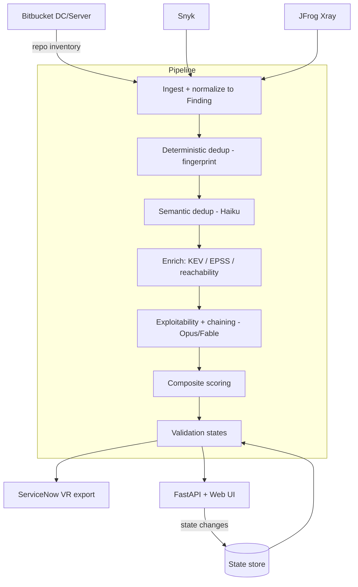
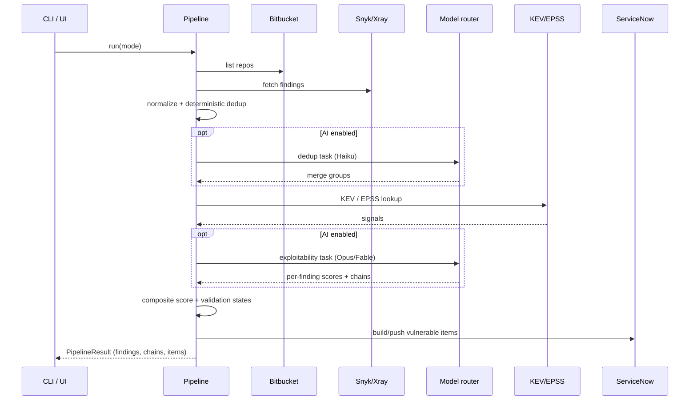

# codescan — Design Document

| | |
|---|---|
| **Status** | Draft / v0.1 |
| **Owner** | Application Security Engineering |
| **Scope** | Enterprise code-scanning aggregation, AI exploitability triage, and ServiceNow VR feed |
| **Related** | `README.md` (usage), source under `src/codescan/` |

---

## 1. Purpose

Two commercial scanners — **Snyk** and **JFrog Xray** — report vulnerabilities
against source in a **local Bitbucket Data Center** install. Neither output is
consumable on its own: they overlap, they rank by raw CVSS (which over-ranks
unreachable CVEs and under-ranks chainable mediums), and neither answers the
question a responder actually asks — *is this exploitable in our environment,
and how bad is it if several issues are combined?*

`codescan` is the pipeline that sits between the scanners and **ServiceNow
Vulnerability Response (VR)**. It aggregates and deduplicates findings, uses an
LLM to assess real-world exploitability and discover multi-step attack chains,
computes a composite risk score, tracks a validation lifecycle, and emits
ServiceNow-ready records — with an analyst UI on top.

### Goals

- One deduplicated finding per real weakness, regardless of how many scanners saw it.
- Exploitability judgement grounded in authoritative signals (KEV, EPSS, reachability), not raw CVSS.
- Explicit **attack chains** — sequences of findings that combine into a materially worse outcome — scored accordingly.
- A composite risk score that reorders the queue by *actual* risk.
- A validation-state lifecycle that survives re-scans (analyst decisions are sticky).
- Output shaped for ServiceNow VR with idempotent upserts.
- Cost-appropriate model use: cheap models for mechanical work, deep models for reasoning.

### Non-goals

- Running the scans themselves. Snyk/Xray own detection; codescan consumes their results.
- Being a system of record. ServiceNow VR is the SoR; codescan is a feeder and triage aid.
- Auto-remediation or auto-closing findings. It *proposes*; humans decide.
- Replacing CVSS/EPSS/KEV. It composes them.

---

## 2. Requirements → design mapping

| Requirement | Design element |
|---|---|
| Code in local Bitbucket | `connectors/bitbucket.py` — on-prem REST API builds the repo inventory (scan surface). |
| Snyk + Xray available | `connectors/snyk.py`, `connectors/xray.py` — live pull or offline export, normalized to one `Finding`. |
| Output for ServiceNow Vulnerabilities | `servicenow.py` — `sn_vul_vulnerable_item` records, idempotent via `correlation_id`. |
| Validation states | `validation.py` + `models.py` — lifecycle + sticky state store + VR state mapping. |
| Deduplication | `dedup.py` (deterministic) + `dedup_ai.py` (semantic, cheap tier). |
| Exploitability incl. chaining, scored | `exploitability.py` (LLM) + `enrich/` (KEV/EPSS/reachability) + `scoring.py`. |
| AI tooling | `llm.py` — task→model router over the Anthropic SDK. |

---

## 3. Architecture


*Figure 1 — codescan pipeline architecture. Also available as [`architecture.svg`](architecture.svg)
and in [`DESIGN.docx`](DESIGN.docx). Regenerate with `python docs/make_diagram.py`.*



The pipeline is a linear series of pure-ish stages over a list of `Finding`
objects. Each stage reads and enriches the same in-memory list; nothing is
scanner-specific past ingestion. The two AI stages (semantic dedup,
exploitability) are optional — the deterministic pipeline produces scored,
ServiceNow-ready output on its own.

### 3.1 Layering

| Layer | Modules | Responsibility |
|---|---|---|
| Connectors | `connectors/` | Talk to external systems; emit/consume raw scanner shapes. |
| Domain model | `models.py` | Canonical `Finding`, fingerprinting, state enums. |
| Processing | `dedup*.py`, `enrich/`, `exploitability.py`, `scoring.py`, `validation.py`, `threatmodel.py` | Transform findings; synthesize threat models. |
| AI infrastructure | `llm.py` | Model routing + structured-output client. |
| Orchestration | `pipeline.py` | Wire stages together; two ingest modes. |
| Interfaces | `cli.py`, `web.py`, `static/` | CLI, HTTP API, dashboard. |

Dependencies point downward only: interfaces depend on orchestration depends on
processing depends on the domain model. Connectors and `llm.py` are leaf
infrastructure.

---

## 4. Domain model

Everything downstream operates on one type, `Finding` (`models.py`). Snyk and
Xray describe the same weakness in different shapes; normalization at ingestion
means dedup, scoring, and export never branch on scanner.

Key sub-objects:

- `Component` — affected package (name, version, ecosystem, purl).
- `Location` — repo + path + branch.
- `Exploitability` — the assessment: level, 0–100 score, reachability, KEV flag, EPSS, rationale, chain IDs.
- `Severity`, `Source`, `ValidationState` — enums.

### 4.1 Fingerprint (the identity function)

Dedup and idempotent ServiceNow upserts both hinge on a stable identity:

```
fingerprint = sha256( vuln_key | component_key | repo )[:32]
  vuln_key       = sorted CVEs, else sorted CWEs, else lowercased title
  component_key  = name@version   (NOT the purl string)
  repo           = location.repo  (NOT the path)
```

Two deliberate choices, both learned from bugs the tests caught:

- **Component, not purl.** Snyk emits a purl; Xray often doesn't. Keying on the
  purl string would prevent the two scanners from ever merging. Normalized
  `name@version` aligns them.
- **Repo, not path.** Snyk reports the manifest path (`pom.xml`); Xray reports
  the artifact coordinate. For SCA findings the repository is the correct
  granularity. (Path-level identity would be right for SAST; see §11.)

---

## 5. Component design

### 5.1 Connectors

All three extend a shared `HttpClient` (bearer auth, retry/backoff on 429/5xx,
paging). Each connector has **two ingestion paths**:

- `fetch()` — live API pull.
- `from_file()` — load a native scanner export (Snyk `--json`, Xray violations).

The offline path is not just for demos: it makes the whole pipeline runnable in
CI, in tests, and against archived scan data with zero credentials. Fixtures
under `fixtures/` drive the default UI and the test suite.

**Repo mapping.** Snyk projects and Xray builds must map back to Bitbucket repos
so their findings land on the same repo and can be deduped. The pipeline passes
a `name → repo` map into each connector; the current implementation matches by
slug and is the documented integration point to harden for production (§11).

### 5.2 Deduplication (two passes)

1. **Deterministic** (`dedup.py`) — group by fingerprint, merge collisions. The
   merge keeps the higher-severity record as primary, unions CVEs/CWEs/
   references/fixes, prefers a present CVSS and the longer description, records
   provenance from every contributing scanner, and keeps the earliest
   `first_seen`. A finding seen by both scanners earns a small **corroboration**
   bonus later in scoring.

2. **Semantic** (`dedup_ai.py`, optional, cheap tier) — catches cross-scanner
   duplicates the fingerprint misses: same weakness, divergent identifiers (one
   has a CVE, the other only a CWE + summary). It is deliberately narrow — it
   only compares findings in the *same repo + same component* and only merges
   what the model marks as clearly the same vulnerability. Different CVEs on the
   same package stay separate unless the descriptions say otherwise.

### 5.3 Enrichment (pluggable framework)

Enrichment is a **framework**, not a fixed step. Each source is a `BaseEnricher`
(`enrich/`) with an `enrich(findings)` method; `build_enrichers` assembles the
enabled ones from config and runs them in order. Adding a source (VEX, internal
asset criticality, exploit-DB) is a new subclass — no pipeline change. Built-in
enrichers:

- **CISA KEV** (`kev.py`) — is the CVE actively exploited in the wild?
- **FIRST EPSS** (`epss.py`) — probability of exploitation (batched lookups).
- **Reachability** (`reachability.py`) — heuristic over scanner metadata; returns
  `True`/`False`/`unknown` (negative phrasing checked first so "not reachable"
  isn't misread as "reachable").
- **AI enrichment** (`ai.py`, optional, cheap tier) — remediation guidance +
  categorization tags, and a reachability judgement when the scanner gave none.
  It complements the exploitability engine (which scores and chains) rather than
  duplicating it, and is routed to the `enrichment` task (Haiku by default).

Deterministic enrichers run first — cheap, authoritative, and grounding for the
LLM stages. Each is toggleable in config and **from the config UI** (§5.9).
Network failures degrade gracefully rather than failing the run.

### 5.4 Exploitability & chaining engine

`exploitability.py` is the core value-add. It sends the LLM, per service, the
finding set plus the deterministic signals and asks two things:

1. **Per-finding exploitability in our context** (0–100) — weighting actively
   exploited / high-EPSS / network-reachable issues up, and unreachable /
   fix-available issues down.
2. **Attack chains** — ordered sequences of findings that combine into greater
   impact (e.g. SSRF → reach an internal service → unauthenticated RCE), each
   with a narrative, preconditions, impact, likelihood, chain score, and MITRE
   ATT&CK technique mapping.

Design points:

- **Grounded, not recalled.** The model receives KEV/EPSS/CVSS/reachability as
  facts, so its judgement is about *our exposure*, not CVE lookup.
- **Structured output.** A JSON Schema (`output_config.format`) guarantees a
  parseable response — no prompt-scraping.
- **Per-service scoping.** Chaining is scoped to a repo/service. Cross-service
  chains are only meaningful between components that actually talk to each
  other, and per-service scoping keeps each request tractable at enterprise
  scale.
- **Chains are cross-finding objects** and are returned separately (attached to
  findings by ID), not stored on any single finding.

### 5.5 Model routing (`llm.py`)

Different tasks need different intelligence tiers. `ModelRouter` resolves a task
name to a `ModelSpec(model, effort, max_tokens)`:

| Task | Default tier | Rationale |
|---|---|---|
| `dedup` | **Haiku 4.5** (effort n/a, 8k tokens) | Mechanical "same vuln?" judgement. |
| `exploitability` | **Opus 4.8** (high effort, 32k) → Fable 5 for hardest chaining | Deep, judgement-heavy reasoning. |
| *(anything else)* | default tier (`ai.model`) | Fallback. |

`LLMClient` adapts each request to the model's capabilities so callers never
have to: it omits `effort`/adaptive-thinking for models that don't support them
(Haiku), and enables server-side **refusal fallbacks** for Fable/Mythos (security
tooling can trip false-positive classifier refusals; the request transparently
re-serves on Opus 4.8 in the same call). Config `ai.tasks.<name>` overrides any
field per task. Adding a new AI stage is a one-liner: name a task, optionally
give it a built-in tier.

### 5.6 Composite scoring (`scoring.py`)

A 0–100 blend of four weighted dimensions (weights configurable, normalized to
sum to 1):

| Dimension | Weight | Signal |
|---|---:|---|
| severity | 0.30 | CVSS-derived base impact |
| exploitability | 0.35 | AI score, EPSS, KEV, **threat signal** (averaged) |
| exposure | 0.20 | network reachability of the path |
| chaining | 0.15 | max chain score of chains the finding is in |

Adjustments on top of the blend:
- **KEV floor** — anything in the KEV catalog is floored to `kev_floor` (85).
  Actively exploited outweighs modelling.
- **Corroboration bonus** — +2 when both scanners agree.
- **Threat boost** — an *additive* bonus (up to `threat_boost`, default 15) for
  findings implicated by the service threat model, scaled by the stronger of the
  finding's threat signal and its service posture (§5.10). Additive, not a
  reweighting, so runs *without* threat modeling are never penalized. Threats
  also enrich the exploitability dimension directly (the threat signal is one of
  the averaged inputs above).

This is the reordering that makes the queue useful: an unreachable critical CVE
drops below a reachable, chainable high.

### 5.7 Validation states (`validation.py`)

Internal lifecycle, mapped to ServiceNow VR states on export:

```
new → under_investigation → confirmed
                          ↘ false_positive
                          ↘ risk_accepted
                          ↘ duplicate
                          ↘ resolved
```

The pipeline **proposes** a conservative initial state (KEV or chained →
confirmed; unreachable + low exploitability → under_investigation as a candidate
FP; high score/severity → confirmed; else new). A human confirms or overrides.

**Stickiness** is the important property. The `StateStore` persists each
decision keyed by fingerprint and tags whether a human set it (`manual`). On
re-scan, `assign_states` honors any manual decision or terminal closure and
never re-opens it — analyst effort is never silently discarded. Machine
proposals remain re-derivable.

### 5.8 ServiceNow export (`servicenow.py`)

Builds `sn_vul_vulnerable_item` records, highest-risk first (VR queue order),
carrying the composite score, risk rating, validation state, and — critically —
the exploitability rationale and attack-chain context in the work notes, so a
responder sees *why* the tool ranked it. `correlation_id` is the fingerprint,
making the import idempotent: re-runs upsert the same item instead of creating
duplicates, and closed items stay closed. Output is written to a file — **JSON**
(`servicenow_import.json`) or, when `servicenow.format: csv`, a **CSV**
(`servicenow_import.csv`) for CSV Import Sets (multi-line work notes are quoted
correctly) — or POSTed to the configured import table via the Table API. The
format is settable in config, the config UI, or with `--sn-format` on the CLI.

### 5.9 Web UI (`web.py` + `static/index.html`)

FastAPI backend holding the latest `PipelineResult` in memory; a single
dependency-free HTML page for the frontend. Endpoints: `GET /api/state`,
`POST /api/scan`, `POST /api/findings/{id}/state`, `GET /api/servicenow`, and
`GET`/`POST /api/config`. Three views:

- **Findings** — the triage queue with filters, signal badges, a per-finding
  detail drawer (CVSS vector, EPSS, reachability, provenance, rationale,
  remediation, tags, threats, chains), and inline validation-state editing that
  persists to the sticky store.
- **Threats** — the per-service threat models (§5.10): STRIDE threats with
  linked findings/chains, assets, entry points, trust boundaries, posture, and
  recommendations.
- **Config** — edit non-secret settings live: default AI tier, per-task model
  routing, enrichment toggles, scoring weights, and the ServiceNow push flag.
  Secrets are shown masked and read-only (they stay in the environment). Edits
  apply to the next scan and persist to `config.overrides.json`, layered over
  the base config on restart. `POST` is validated server-side and rejected with
  400 on bad input.

---

### 5.10 Threat modeling (`threatmodel.py`, optional, deep tier)

Where the exploitability engine works bottom-up (per-finding scores, concrete
chains), threat modeling is the top-down counterpart. Per service it produces a
**STRIDE threat model** grounded in that service's findings and chains:

- **Assets** — what an attacker targets (data, credentials, functionality) with
  a sensitivity note.
- **Entry points / trust boundaries** — the attack surface implied by the
  components and findings.
- **Threats** — STRIDE-categorized, each citing the `related_finding_ids` and
  `related_chain_ids` that evidence it, plus likelihood, impact, and mitigations.
  The model is told to prefer fewer, well-grounded threats over generic ones.
- **Posture** — an overall risk level, summary, and prioritized recommendations.

It's optional (`threat_model.enabled`), per-service (like exploitability), routed
to the `threat_model` task (the default deep tier unless overridden), and emits
a `threat_models.json` artifact alongside the ServiceNow export. Threats
reference findings by ID, so the UI cross-links both directions (a finding's
drawer shows the threats it belongs to; a threat lists its findings).

**It feeds back into scoring.** Because it runs *before* the scorer (unlike a
terminal report), `apply_threat_influence` writes results back onto findings: it
records the citing threat IDs, derives a per-finding `threat_signal` (0–100 from
the strongest citing threat's likelihood), and raises the categorical
exploitability *level* when the threat implies more than the isolated assessment
did. The scorer then consumes the threat signal (exploitability dimension) and
the per-service risk posture (additive threat boost) — see §5.6.

## 6. Data flow — a scan



---

## 7. Key design decisions

| Decision | Alternatives considered | Why |
|---|---|---|
| One canonical `Finding` model | Keep scanner-native shapes, branch downstream | A single type keeps dedup/scoring/export scanner-agnostic; adding a third scanner is one connector, no downstream changes. |
| Fingerprint on `(vuln, component, repo)` | Include scanner id; include path; use purl | Excludes scanner so cross-tool dupes merge; excludes path/purl because scanners disagree on both. |
| Deterministic + optional AI dedup | AI-only; deterministic-only | Deterministic is free and exact; AI catches the residual near-dupes cheaply (Haiku) without being on the critical path. |
| Ground the LLM with KEV/EPSS/reachability | Let the model recall CVE details | Grounding turns "what is this CVE" (unreliable) into "given these facts, how exposed are we" (its strength). |
| Structured outputs (JSON Schema) | Parse free-text | Guaranteed-parseable responses; no brittle scraping. |
| Per-service chaining scope | Whole-estate chaining | Meaningful (connected components) and tractable (bounded request size). |
| Task-based model routing | One model everywhere | Haiku for mechanical work, Opus/Fable for reasoning — right cost per task. |
| Composite score with KEV floor | Rank by CVSS | CVSS mis-ranks; the blend + floor put actively-exploited and chainable issues on top. |
| Sticky, human-tagged validation states | Recompute every run | Analyst decisions must survive re-scans; machine proposals stay re-derivable. |
| Idempotent export via `correlation_id` | Insert-only | Prevents duplicate VR items and re-opening closed ones across daily runs. |
| Default to Opus 4.8, opt into Fable 5 | Default Fable | Opus is the right default; Fable is reserved for hardest chaining and auto-enables refusal fallbacks. |

---

## 8. Security & privacy

This tool handles vulnerability data about first-party code and sends some of it
to an LLM and to ServiceNow. Considerations:

- **What leaves the environment.** The exploitability engine sends finding
  metadata (titles, CVEs, package coordinates, descriptions, deterministic
  signals) to the Anthropic API — **not** source code. Descriptions come from
  scanner output. Deployments with stricter data-residency needs can disable the
  AI stages (`--no-ai`) and run fully deterministic, or route to an approved
  Anthropic deployment (Bedrock/Vertex/first-party) per policy.
- **Secrets.** All credentials (Bitbucket, Snyk, Xray, ServiceNow, Anthropic)
  are injected via env vars / `${ENV}` interpolation; none are committed.
  `.gitignore` excludes `.env` and generated output.
- **Refusal handling.** Security content can trip an LLM's safety classifiers.
  On Fable/Mythos the client opts into server-side fallbacks so a false-positive
  refusal is transparently re-served rather than failing the run; a genuine
  refusal surfaces as an error and the deterministic score still stands.
- **Least privilege.** Bitbucket needs read; ServiceNow needs write to the
  import table only; scanner tokens are read-only.
- **Idempotency as integrity.** `correlation_id` upserts prevent a misfired run
  from flooding VR with duplicates.

---

## 9. Failure modes & resilience

| Failure | Behavior |
|---|---|
| KEV/EPSS feed unreachable | Treated as empty; run continues on CVSS/AI/reachability. |
| LLM refuses (genuine) | Raised as an error; deterministic scoring already stands. |
| LLM refuses (false positive, Fable) | Auto re-served by fallback model in the same call. |
| Connector 429/5xx | Retried with backoff in `HttpClient`. |
| Malformed scanner export | Per-record normalization is defensive; unknown fields ignored. |
| ServiceNow push fails | Records are always written to file first, then pushed; the file is the durable artifact. |

The AI stages are strictly additive: with `use_ai=False` the pipeline produces a
complete, scored, exportable result. AI enriches; it is never a hard dependency.

---

## 10. Scalability

- **Ingestion** paginates all three sources.
- **Dedup/enrichment/scoring** are O(n) / O(n log n) over findings, in memory.
- **EPSS** lookups are batched (100 CVEs/request).
- **LLM calls** are the cost/latency driver. They are bounded by *service*
  (one exploitability call per repo, dedup calls per repo+component cluster),
  not by total finding count — a repo with 500 findings is one exploitability
  call, not 500. Cheap-tier routing keeps the mechanical calls inexpensive.
- **Horizontal scale** path: the per-service AI calls are embarrassingly
  parallel; batching or the Batches API is the natural next step for very large
  estates (§11).

---

## 11. Known limitations & future work

- **Repo mapping** is slug-based. Production should map Snyk projects / Xray
  builds to Bitbucket repos via explicit metadata (tags, build properties).
- **Reachability** is a metadata heuristic. Feeding real call-graph /
  reachable-vuln data into `Exploitability.reachable` would sharpen both the AI
  judgement and the exposure score.
- **SCA-oriented fingerprint.** Repo-level identity is right for dependency
  findings; SAST findings need path/line in the fingerprint. A `finding_kind`
  discriminator would let the fingerprint switch granularity.
- **State store is a JSON file.** Fine for a single runner; a shared datastore is
  needed for concurrent runners / HA.
- **AI concurrency.** Per-service calls are serial today; parallelizing or moving
  to the Batches API would cut wall-clock time on large estates.
- **ServiceNow field mapping** targets a generic `sn_vul_vulnerable_item` import;
  it must be aligned to each deployment's VR transform map.
- **No auth on the web UI.** The dashboard assumes a trusted network / upstream
  SSO; add authn/authz before exposing it.

---

## 12. Testing

- **Deterministic pipeline** (`tests/test_pipeline.py`) — runs offline over
  fixtures, asserting cross-scanner dedup, corroboration, reachability-driven
  scoring, validation states, ServiceNow record shape, and sticky closures.
- **Model router** (`tests/test_llm_router.py`) — pure resolution logic
  (Haiku default for dedup, default-tier fallback, override precedence,
  partial-override inheritance); no network/key.
- **Web API** (`tests/test_web.py`) — FastAPI TestClient over the state,
  scan, state-change (incl. sticky-across-rescan), validation, and ServiceNow
  endpoints.

All tests run offline with no Anthropic key. The AI stages are integration
points validated by contract (schema) rather than live calls.

---

## 13. Configuration surface (reference)

`config/config.example.yaml` (secrets via `${ENV}`):

- `ai` — default tier + per-task routing (`tasks.dedup`, `tasks.exploitability`).
- `bitbucket` / `snyk` / `xray` — endpoints, tokens, project scoping, TLS.
- `servicenow` — instance, credentials, `push` toggle, import table.
- `enrichment` — KEV/EPSS feed URLs.
- `scoring` — dimension weights + `kev_floor`.

CLI: `codescan scan` (pipeline), `codescan serve` (UI), `codescan summary`
(inspect an export). Flags gate AI (`--no-ai` / `--ai`), network enrichment
(`--offline`), and live vs fixtures (`--live` / `--fixtures`).
